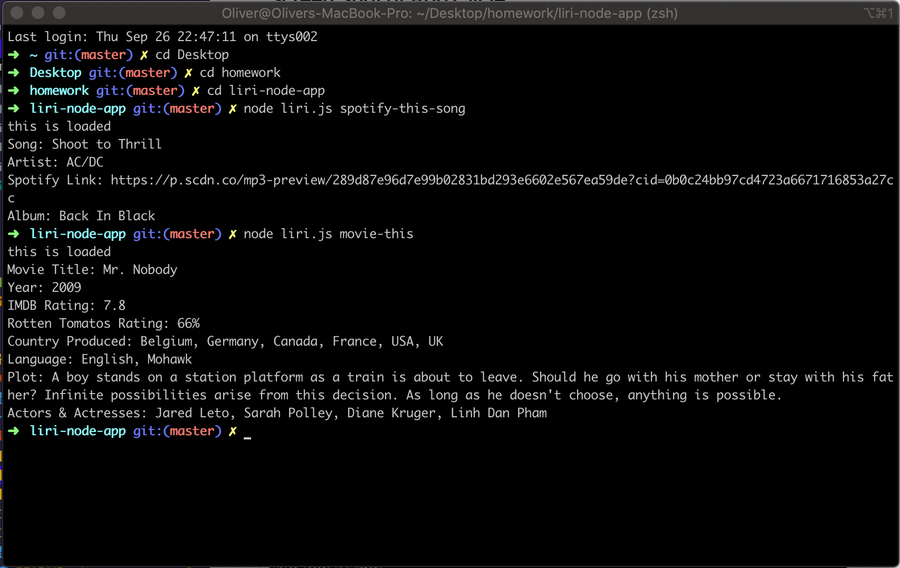

# Liri Node App

## Screen Shot of App Cycle:
Main

Default Song & Movie Methods (Changed default song b/c spotify was sending back a song with a similiar title to "The Sign". More details below.


## Link to Video on Github Pages:

https://olisun.github.io/liri-node-app/index.html

## About the project:
In this assignment, we had to build an app called LIRI. LIRI is like iPhone's SIRI. However, while SIRI is a Speech Interpretation and Recognition Interface, LIRI is a Language Interpretation and Recognition Interface. LIRI will be a command line node app that takes in parameters and gives you back data.

To retrieve the data that will power this app, I used the following node packages:
  * Axios package (for sending requests)
  * Bands in Town API (to get back band/artist info)
  * Spotify API (to get back song info)
  * OMDB API (to get back movie info)
  * Moment node package (to format the concert date for te bands in town requrement)
  * DotEnv (a zero-dependency module that loads environment variables from a .env file into process.env.)

Liri takes in one of the following commands:
  1. 'concert-this'
  2. 'spotify-this-song'
  3. 'movie-this'
  4. 'do-what-it-says'

What Each Command Does.
  * node liri.js concert-this <artist/band name here>
    This will search the Bands in Town Artist Events API ("https://rest.bandsintown.com/artists/" + artist + "/events?app_id=codingbootcamp") for an artist and render the following information about each event to the terminal:
      1. Name of the venue
      2. Venue location
      3. Date of the Event (use moment to format this as "MM/DD/YYYY")

  * node liri.js spotify-this-song '<song name here>'
    This will show the following information about the song in your terminal/bash window
      1. Artist(s)
      2. The song's name
      3. A preview link of the song from Spotify
      4. The album that the song is from
      5. If no song is provided then your program will default to "The Sign"      by Ace of Base.

  * node liri.js movie-this '<movie name here>'
    This will output the following information to your terminal/bash window:
      1. Title of the movie.
      2. Year the movie came out.
      3. IMDB Rating of the movie.
      4. Rotten Tomatoes Rating of the movie.
      5. Country where the movie was produced.
      6. Language of the movie.
      7. Plot of the movie.
      8. Actors in the movie.
      2. If the user doesn't type a movie in, the program will output data for the movie 'Mr. Nobody.'

  * node liri.js do-what-it-says
    Using the fs Node package, LIRI will take the text inside of random.txt and then use it to call one of LIRI's commands.
    It should run spotify-this-song for "I Want it That Way," as follows the text in random.txt.
  
## Techologies used to build:
  * Node.js
  * JavaScript
  * API's & Node packages mentioned above

## Methodology:

I followed closely the class activities in node. I also leaned heavily on the docs for the various node packages, particulary Spotify.

I created four separate functions, one for each command.  The get-Movie, Spotify & Artist functions bascially collect the required data from the API's and logs them to the console and CLI. The random function reads the random file and outputs the text inside to the console and CLI

I created if-else conditions so that Liri knows what to do when the user types a specific command. Each command then calls one of the functions.

## Problems That I Overcame:

I had diffuculty at first getting data from spotify. I overcame this by studying their docs in the node-spotify-API section of npm. I ended up using their .request method because .search was returning the wrong songs.

Trying to figure out a way to add a video of the app work-flow. I decided to create an index.html to hold the video and then display that on github pages. The link to the videop will then be in the readme.

Unable to get the spotify and movie functions to retreive the required song/movie if no input is provided by the user. Overcame by setting a new var = process.argv[3] then writing an if condition stating if no song/movie is inputed, retreive this song/movie. PLEASE NOTE - I changed the song from "The Sign" by Ace of Base to "Shoot to Thrill" by AC DC because spotify was returning a song called "The Sign of the Time from Harry Styles. I just want to show that this part of the function that lists a default song works.

## Problems Still Facing:

Unable to get Liri to call the spotify function when reading the random.txt file contents. The text being appeneded to the CLI works. Error message shows undefined, cannot read property. Still working on this!

## Code Snippets:

Capturing CLI user input and programming Liri what command goes with what logic (function).
```
// Storing the arguments in an array in order to capture user input in the command line. 
var nodeArguments = process.argv;
var nodeCommand = process.argv[2];

// Creating logic for Liri so she knows what function to run when the user types in one of the specific commands ()
if (nodeCommand === 'movie-this') {
  getMovieInfo();
} else if (nodeCommand === 'concert-this') {
  getArtistInfo();
} else if (nodeCommand === 'do-what-it-says') {
  randomTextInstx();
} else if (nodeCommand === 'spotify-this-song') {
  getSpotifyInfo();
} else {
  console.log('Not a valid command!');
};
```
Function feature for 'movie-this' that sets a default movie if no movie is entered by the user..
```
  // Setting a variable for song input after spotify command
  var movieInput = process.argv[3]
    // If no movie is inputted after the command, the default movie will be 'Mr. Nobody'.
  if (!movieInput) {
    movieName = 'Mr. Nobody'
  }
 
```

Function feature for 'spotify-this-song' that sets a default song if no song is entered by the user.
```
  // Setting a variable for song input after spotify command
  var songInput = process.argv[3]
    // If no song is inputted after the command, the default song will be 'Shoot to Thrill'.
  if (!songInput) {
    songName = 'Shoot to Thrill'
  }
  
```

For displaying video of the working app.
```
<body>

  <video width="800" controls>
    <source src="videos/app.mov" type="video/mp4">
  </video>

  <video width="800" controls>
    <source src="videos/app2.mov" type="video/mp4">
  </video>


</body>
```