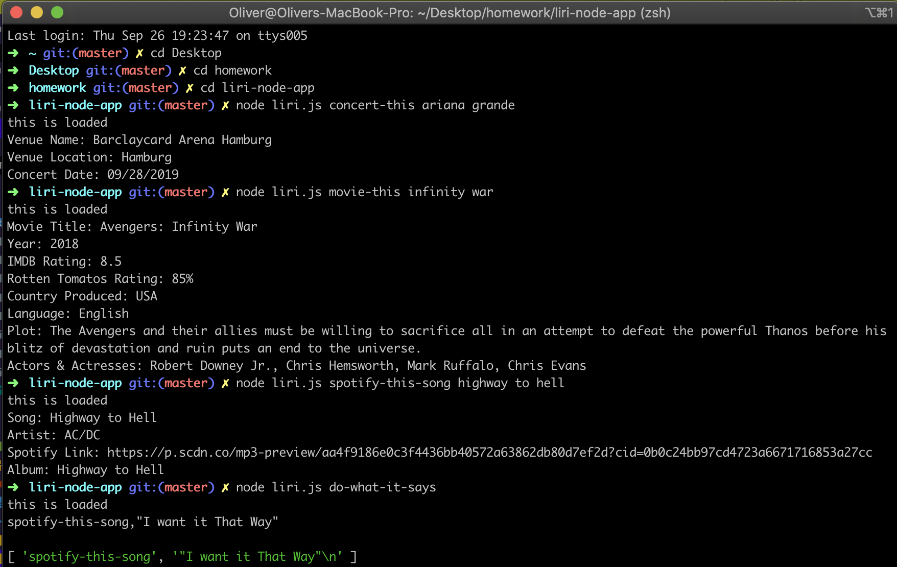

# Liri Node App

## Screen Shot of App (Working) App Cycle:


## Link to Video on Github Pages:

https://olisun.github.io/liri-node-app/index.html

## About the project:
In this assignment, we had to build an app called LIRI. LIRI is like iPhone's SIRI. However, while SIRI is a Speech Interpretation and Recognition Interface, LIRI is a Language Interpretation and Recognition Interface. LIRI will be a command line node app that takes in parameters and gives you back data.

To retrieve the data that will power this app, I used the following node packages:
  * Axios package (for sending requests)
  * Bands in Town API (to get back band/artist info)
  * Spotify API (to get back song info)
  * OMDB API (to get back movie info)
  * Moment node package (to format the concert date for te bands in town requrement)
  * DotEnv (a zero-dependency module that loads environment variables from a .env file into process.env.)

Liri takes in one of the following commands:
  1. 'concert-this'
  2. 'spotify-this-song'
  3. 'movie-this'
  4. 'do-what-it-says'

What Each Command Does.
  * node liri.js concert-this <artist/band name here>
    This will search the Bands in Town Artist Events API ("https://rest.bandsintown.com/artists/" + artist + "/events?app_id=codingbootcamp") for an artist and render the following information about each event to the terminal:
      1. Name of the venue
      2. Venue location
      3. Date of the Event (use moment to format this as "MM/DD/YYYY")

  * node liri.js spotify-this-song '<song name here>'
    This will show the following information about the song in your terminal/bash window
      1. Artist(s)
      2. The song's name
      3. A preview link of the song from Spotify
      4. The album that the song is from
      5. If no song is provided then your program will default to "The Sign"      by Ace of Base.

  * node liri.js movie-this '<movie name here>'
    This will output the following information to your terminal/bash window:
      1. Title of the movie.
      2. Year the movie came out.
      3. IMDB Rating of the movie.
      4. Rotten Tomatoes Rating of the movie.
      5. Country where the movie was produced.
      6. Language of the movie.
      7. Plot of the movie.
      8. Actors in the movie.
      2. If the user doesn't type a movie in, the program will output data for the movie 'Mr. Nobody.'

  * node liri.js do-what-it-says
    Using the fs Node package, LIRI will take the text inside of random.txt and then use it to call one of LIRI's commands.
    It should run spotify-this-song for "I Want it That Way," as follows the text in random.txt.
  
## Techologies used to build:
  * Node.js
  * JavaScript
  * API's & Node packages mentioned above

## Methodology:

I followed closely the class activities in node. I also leaned heavily on the docs for the various node packages, particulary Spotify.

I created four separate functions, one for each command.  The get-Movie, Spotify & Artist functions bascially collect the required data from the API's and logs them to the console and CLI. The random function reads the random file and outputs the text inside to the console and CLI

I created if-else conditions so that Liri knows what to do when the user types a specific command. Each command then calls one of the functions.

## Problems That I Overcame:

I had diffuculty at first getting data from spotify. I overcame this by studying their docs in the node-spotify-API section of npm. I ended up using their .request method because .search was returning the wrong songs.

Trying to figure out a way to add a video of the app work-flow. I decided to create an index.html to hold the video and then display that on github pages. The link to the videop will then be in the readme.

## Problems Still Facing:

Unable to get Liri to call the spotify function when reading the random.txt file contents. The text being appeneded to the CLI works. Error message shows undefined, cannot read property. Still working on this!

Unable to get the spotify and movie functions to retreive the required song/movie if no input is provided by the user. Error message shows undefined, cannot read property. Still working on this!

## Code Snippets:

Linking all the necessary packages (Spotify's keys are linked inside of the getSpotifyInfo function). 
```
// This reads and sets any environment variables with dotenv. 
require('dotenv').config();

// This imports the keys.js file with has my spotify id and secret id mapped from my .env file with actually has the ids stored (.env is part of .gitignore). 
var keys = require('./keys.js');

// Setting variables to the node packages needed. 
var axios = require('axios');
var moment = require('moment');
var Spotify = require('node-spotify-api');
var fs = require('fs');
```

Capturing CLI user input and programming Liri what command goes with what logic (function).
```
// Storing the arguments in an array in order to capture user input in the command line. 
var nodeArguments = process.argv;
var nodeCommand = process.argv[2];

// Creating logic for Liri so she knows what function to run when the user types in one of the specific commands ()
if (nodeCommand === 'movie-this') {
  getMovieInfo();
} else if (nodeCommand === 'concert-this') {
  getArtistInfo();
} else if (nodeCommand === 'do-what-it-says') {
  randomTextInstx();
} else if (nodeCommand === 'spotify-this-song') {
  getSpotifyInfo();
} else {
  console.log('Not a valid command!');
};
```
Function for 'movie-this'.
```
// Function for getting the moving data from omdb using axios.
function getMovieInfo() {
  // Creating an empty string to store whatever the user types for movie-this. 
  var movieName = '';
  // Creating a for-loop to to solve the problem if the name of the movie is more than one word. 
  for (var i = 3; i < nodeArguments.length; i++) {
    // In English, this says if i, is greater than indice 2 (first two are file paths and third indice is the command movie-this) and less than whatever the length of the movie the user typed for movie-this, then that's the movie. 
    if (i > 3 && i < nodeArguments.length) {
      movieName = `${movieName} ${nodeArguments[i]}` // <-- using back-ticks with $ and {} instead of '' and concatonation.
        //Otherwise, if i is just one word, that's also the movie.
    } else {
      movieName += nodeArguments[i];
    };
  };
  // Setting the queryURL equal to a variable. 
  var queryURL = "http://www.omdbapi.com/?t=" + movieName + "&y=&plot=short&apikey=abb02c3b";

  // Now time to use axios through a promise function. 
  axios.get(queryURL).then(
      function(movieResponse) {
        console.log('Movie Title: ' + movieResponse.data.Title);
        console.log('Year: ' + movieResponse.data.Year);
        console.log('IMDB Rating: ' + movieResponse.data.imdbRating);
        console.log('Rotten Tomatos Rating: ' + movieResponse.data.Ratings[1].Value);
        console.log('Country Produced: ' + movieResponse.data.Country);
        console.log('Language: ' + movieResponse.data.Language);
        console.log('Plot: ' + movieResponse.data.Plot);
        console.log('Actors & Actresses: ' + movieResponse.data.Actors);
      })
    // These tell you what the errors messages are if any. 
    .catch(function(error) {
      if (error.movieResponse) {
        // Successful request but the server came back with a status code outside of the range of 2xx. 
        console.log("---------------Data---------------");
        console.log(error.movieResponse.data);
        console.log("---------------Status---------------");
        console.log(error.movieResponse.status);
        console.log("---------------Status---------------");
        console.log(error.movieResponse.headers);
      } else if (error.request) {
        // Successful request but no movieResponse came back. You'll get details of the error in error.request in the form of an object.
        console.log(error.request);
      } else {
        // Unsuccessful request.
        console.log("Error", error.message);
      }
      console.log(error.config);
    });
};
```

Function for 'concert-this'.
```
// Function for getting the artist/band data from bands in town using axios.
function getArtistInfo() {
  // Creating an empty string to store whatever the user types for concert-this. 
  var artistName = '';
  // Creating a for-loop to to solve the problem if the name of the artist is more than one word. 
  for (var i = 3; i < nodeArguments.length; i++) {
    // This says if i, is greater than indice 2 (first two are file paths and third indice is the command concert-this) and less than whatever the length of the artist the user typed for concert-this, then that's the movie. 
    if (i > 3 && i < nodeArguments.length) {
      artistName = `${artistName} ${nodeArguments[i]}` // <-- using back-ticks with $ and {} instead of '' and concatonation.
        //Otherwise, if i is just one word, that's also the artist. 
    } else {
      artistName += nodeArguments[i];
    };
  };
  // Setting the queryURL equal to a variable. 
  var queryURL = "https://rest.bandsintown.com/artists/" + artistName + "/events?app_id=codingbootcamp";

  // Now time to use axios through a promise function. 
  axios.get(queryURL).then(
      function(artistResponse) {
        console.log('Venue Name: ' + artistResponse.data[0].venue.name);
        console.log('Venue Location: ' + artistResponse.data[0].venue.city);
        console.log('Concert Date: ' + moment(artistResponse.data[0].datetime).format('MM/DD/YYYY'));

      })
    // These tell you what the errors messages are if any. 
    .catch(function(error) {
      if (error.songResponse) {
        // Successful request but the server came back with a status code outside of the range of 2xx. 
        console.log("---------------Data---------------");
        console.log(error.artistResponse.data);
        console.log("---------------Status---------------");
        console.log(error.artistResponse.status);
        console.log("---------------Status---------------");
        console.log(error.artistResponse.headers);
      } else if (error.request) {
        // Successful request but no songResponse came back. You'll get details of the error in error.request in the form of an object.
        console.log(error.request);
      } else {
        // Unsuccessful request.
        console.log("Error", error.message);
      }
      console.log(error.config);
    });
};
```

Function for 'spotify-this-song'
```
// Function for getting the artist/band data from bands in town using axios.
function getSpotifyInfo() {
  // Establishing the id and secret id stored in the keys.js file. 
  var spotify = new Spotify(keys.spotify)
    // Creating an empty string to store whatever the user types for concert-this. 
  var songName = '';
  // Creating a for-loop to to solve the problem if the name of the artist is more than one word. 
  for (var i = 3; i < nodeArguments.length; i++) {
    // This says if i, is greater than indice 2 (first two are file paths and third indice is the command concert-this) and less than whatever the length of the artist the user typed for concert-this, then that's the movie. 
    if (i > 3 && i < nodeArguments.length) {
      songName = `${songName} ${nodeArguments[i]}` // <-- using back-ticks with $ and {} instead of '' and concatonation. 
        //Otherwise, if i is just one word, that's also the artist. 
    } else {
      songName += nodeArguments[i];
    };
  };
  // Using Spotiy's node API package to retreive song data.
  spotify.request("https://api.spotify.com/v1/search?q=track:" + songName + "&type=track&limit=10").then(function(songResponse) {
    console.log('Song: ' + songResponse.tracks.items[0].name);
    console.log('Artist: ' + songResponse.tracks.items[0].artists[0].name);
    console.log('Spotify Link: ' + songResponse.tracks.items[0].preview_url);
    console.log('Album: ' + songResponse.tracks.items[0].album.name);
    // These tell you what the errors messages are if any. 
  }).catch(function(error) {
    if (error.songResponse) {
      // Successful request but the server came back with a status code outside of the range of 2xx. 
      console.log("---------------Data---------------");
      console.log(error.songResponse.data);
      console.log("---------------Status---------------");
      console.log(error.songResponse.status);
      console.log("---------------Status---------------");
      console.log(error.songResponse.headers);
    } else if (error.request) {
      // Successful request but no songResponse came back. You'll get details of the error in error.request in the form of an object.
      console.log(error.request);
    } else {
      // Unsuccessful request.
      console.log("Error", error.message);
    }
    console.log(error.config);
  });
};
```

Function for 'do-what-it-says'.
```
// Function for getting the text from inside random.txt and then use it to call one of liri's commands.
function randomTextInstx(data, dataTwo) {
  // This uses fs's node package to read the contents of random.txt and store it in a variable named data. utf8 is included as a parameter to prevent garbage data from being included.
  fs.readFile('random.txt', 'utf8', function(error, data) {
    // This if statement is used for error checking.
    if (error) {
      return console.log(error);
    };
    // This will print the text inside of random.txt to the console. 
    console.log(data);
    // This will take the text inside of random.txt; split it where the comma is and put it all in an array. The comma in the text desiignates the indice. 
    var dataArray = data.split(',');
    // The new array will look like this example --> ['spotify-this-song', '"I want it That Way"']. 
    console.log(dataArray)
      // This is supposed to run the getSpotifyInfo function but it's returning undefined in the terminal. Still working on this!
    getSpotifyInfo(dataArray[0], dataArray[1]);
  })
}
```